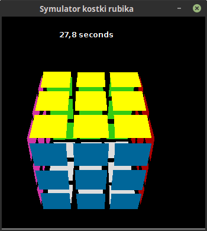

# rubicscube-simulator

Rubic's cube simulator operated by a keyboard.

Inspired by hi-games.net.

Keybindings:

    J -> U
    F -> U'

    I -> R
    K -> R'

    U -> r
    M -> r'

    D -> L
    E -> L'

    R -> l'
    V -> l

    G -> F'
    H -> F

    L -> D'
    S -> D

    O -> B'
    W -> B

    Y, T -> x
    N, B -> x'

    P -> z
    Q -> z'

    A -> y'
    ; -> y

    SPACE SCRAMBLE

    ESC -> EXIT
